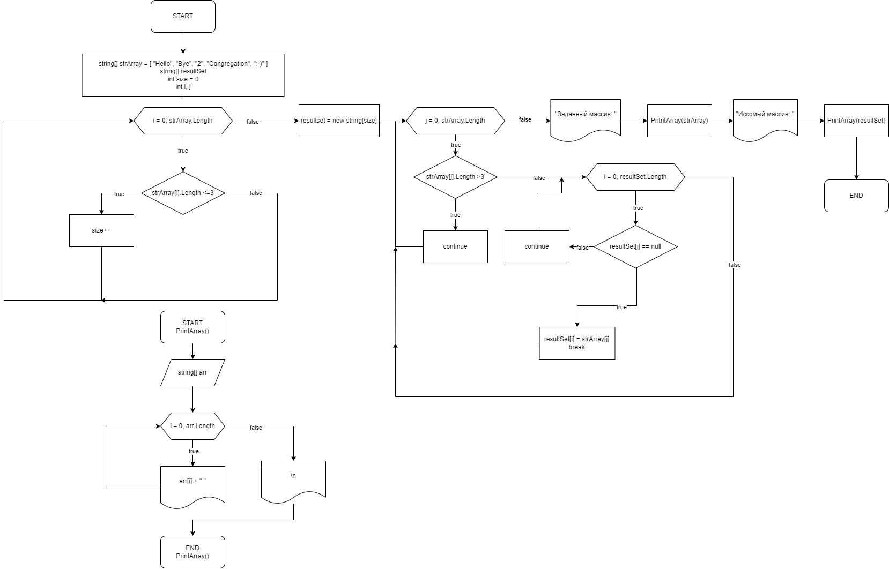

# <h1 id="top-head" style="color:lightblue; background: black">  RAVolkov_test_work

# <h1 style="background:black"> Контрольная работа по основному блоку

>No code?...Go code!
 @Roman Volkov

## <h2 style="background:black"> Задача:
 Написать программу, которая из имеющегося массива строк формирует новый массив из строк, длина которых меньше, либо равна 3 символам. Первоначальный массив можно ввести с клавиатуры, либо задать на старте выполнения алгоритма. При решении не рекомендуется пользоваться коллекциями, лучше обойтись исключительно массивами.

## <h2 style="background:black"> Блок-схема алгоритма

## <h2 style="background:black"> Описание алгоритма решения

Для начала, так как по заданию необходимо получить новый массив, то была создана функция `PrintArray(string[] arr)` с аргументом `string[] arr` в виде строчного массива, выполняющая вывод в консоль содержимого подаваемого массива. Реализован данный алгоритм в виде цикла **for** от 0 до длины массива с шагом 1, где в теле цикла просходит вывод в консоль с помощью команды `Console.Write(arr[i] + "  ")`, также после выполнения цикла используется команда Console.WriteLine() для перехода курсора консоли на новую строку.  

В начале основного потока программы происходит определение строчных массивов **strArray** и **resultSet**, где для **strArray** сразу указывается значение элементов, т.к. по заданию разрешается задать на старте выполнения алгоритма первоначальный массив. После чего объявляются индексы **i**, **j** и переменная **size**, которая будет хранить размер результирующего массива, по умолчанию 0.  

После блока инициализации в теле программы представлены 2 цикла, реализующие решение задачи. Первый **for** проходя по массиву **strArray** производит проверку каждого элемента(строки) на его длину, в случае прохождения проверки инкрементируем значение переменной **size**. В результате, в **size** находится кол-во элементов первоначального массива, которые имеют длину меньше или равную 3. После чего объявим размер массива **resultSet** равный значению **size**. Второй цикл for является вложенным, где внешний цикл проходит по массиву **strArray**, а внутренный по **resultSet**. Причем вход во внутренний цикл происходит только в том случае, когда длина текущего элемента **strArray <= 3**, иначе переходим на следующую итерацию. Во внутреннем цикле происходит проверка каждого элемента массива **resultSet**, является ли он пустым и при положительном результате происходит запись текущего элемента **strArray** в текущий элемент **resultSet** и выход из внутреннего цикла, иначе переходим на следующую итерацию.

В результате получаем заполненный массив **resultSet**, элементы которого строки длиной меньше или равной 3 из первоначального массива **strArray**, что и требовалось в задаче. В конце происходит вывод обоих массивов с помощью вызова функции `PrintArray(string[] arr)` и команд `Console.WriteLine()`.

[Return to the main header](#top-head)
